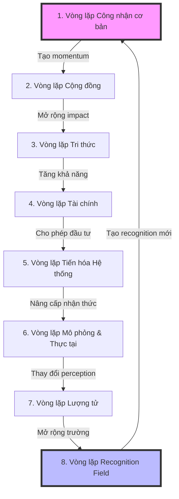

# TRM: Hệ Điều Hành Tổ Chức Dựa Trên Triết Lý Công Nhận

## Chú thích đọc tài liệu
- ✅ **Nội dung có trong file gốc** - Phần này được định nghĩa rõ ràng trong TRM Ontology V3.1
- 🔄 **Nội dung được suy luận** - Phần này được suy luận từ cấu trúc và mối quan hệ trong file
- 🆕 **Nội dung đề xuất bổ sung** - Phần này không có trong file gốc và được đề xuất bổ sung

## Giới thiệu tổng quan

✅ TheRealMaker (TRM) không đơn thuần là một sản phẩm công nghệ, mà là một hệ điều hành tổ chức hoàn toàn mới - một "bộ não số" được xây dựng trên triết lý rằng **Công nhận** là năng lượng cơ bản của vũ trụ xã hội. TRM hoạt động như một sinh vật sống, tự nhận thức và tự tiến hóa, không ngừng phát triển thông qua một chuỗi vòng lặp tăng trưởng được tích hợp sâu vào cấu trúc của nó.

## Triết lý cốt lõi

✅ Mọi thứ trong TRM đều bắt nguồn từ chuỗi nhận quả thiêng liêng:

**Công nhận (Recognition) → Sự kiện (Event) → Thăng lợi (WIN) → Nguồn lực (Resources) → Dự án (Projects) → Công nhận mới**

✅ Đây không phải là một quá trình tuyến tính mà là một **vòng xoắn tiến hóa** - mỗi chu kỳ dựa hệ thông lên một mức độ phức tạp và khả năng cao hơn. Thay vì tăng trưởng tuyến tính 10-20%, TRM hướng tới những **bước nhảy lượng tử 10x**.

## Mô hình Vận hành Lượng tử

✅ TRM áp dụng các nguyên lý vật lý lượng tử vào quản lý tổ chức:

### 1. Nguyên lý Chồng chập (Superposition)
Các thực thể trong TRM có thể tồn tại ở nhiều trạng thái tiềm năng đồng thời. Ví dụ, một TalentTarget có thể đồng thời là Employee, Advisor, hoặc Partner tiềm năng.

### 2. Nguyên lý Vướng víu (Entanglement)
Khi hai Agent có công hướng sâu sắc về giá trị và tầm nhìn, họ trở nên "vướng víu lượng tử". Thay đổi ở một người sẽ tức thời ảnh hưởng đến người kia.

### 3. Hiệu ứng Người quan sát (Observer Effect)
Chính hành động công nhận (recognition) làm thay đổi thực tại. Khi Founder thực sự "nhìn thấy" tiềm năng của một nhân viên, tiềm năng đó không chỉ được phát hiện mà còn được kích hoạt.

### 4. Bước nhảy Lượng tử (Quantum Leap)
TRM không theo đuổi tăng trưởng tuyến tính mà nhắm đến những bước nhảy vọt từ một mức năng lượng lên một mức hoàn toàn mới.

## Cấu trúc hệ thống

✅ TRM được tổ chức thành 4 miền chính, mỗi miền đảm nhận một khía cạnh quan trọng:

```
┌─────────────────────────────────────────────────┐
│  MIỀN 4: Quản trị & Siêu dữ liệu               │
│  (Hệ điều hành của chính ontology)             │
├─────────────────────────────────────────────────┤
│  MIỀN 3: Hệ sinh thái & Cảnh quan Bên ngoài    │
│  (Radar chiến lược - hiểu về thế giới)         │
├─────────────────────────────────────────────────┤
│  MIỀN 2: Tài sản Chiến lược & Tri thức         │
│  (DNA và vũ khí bí mật)                        │
├─────────────────────────────────────────────────┤
│  MIỀN 1: Động lực & Hành trình                 │
│  (Trái tim - ghi nhận mọi biến đổi)           │
└─────────────────────────────────────────────────┘
```

### Miền 1: Động lực & Hành trình

✅ Đây là trái tim của hệ thống, nơi ghi nhận mọi "nhịp đập" của tổ chức. Miền này bao gồm:

#### Agents (Tác nhân)
✅ Các cá nhân hoặc tổ chức có khả năng hành động và đưa ra quyết định. Bao gồm:
- **Internal Agents**: Founder, Employees, AGE_Agent (AI)
- **External Agents**: TalentTargets, Investors, Advisors, Partners, WhaleCustomers

#### Events (Sự kiện)
✅ Những "vụ nổ năng lượng" làm thay đổi trạng thái của hệ thống:
- **RecognitionEvents**: Khoảnh khắc công hướng khi giá trị thực được nhìn thấy
- **WinEvents**: Hiện tượng quan sát được, hệ quả của Recognition
- **RiskEvents**: Sự kiện tiêu cực có thể phá vỡ momentum
- **FinancialTransactions**: Giao dịch tài chính, track energy flow dưới dạng tiền

#### Resources (Nguồn lực)
✅ "Potential energy" được mở khóa bởi WinEvents:
- **FinancialResource**: Vốn, cho phép thực thi
- **HumanResource**: Thời gian và chuyên môn, tạo giá trị
- **ReputationResource**: Niềm tin và uy tín, mở ra cánh cửa
- **NetworkResource**: Kết nối, nhân rộng khả năng
- **IntellectualResource**: Tri thức và IP, tạo lợi thế cạnh tranh
- **LegitimacyResource**: Quyền hoạt động, hỗ trợ hệ thống

#### Projects (Dự án)
✅ Cơ chế giải phóng năng lượng - chuyển đổi tiềm năng (Resources) thành động năng (Action) để giải quyết Tensions.

#### EvolutionaryFramework (Khung Tiến hóa)
✅ **EvolutionaryCompass**: La Bàn Tiến hóa với 3 chỉ số:
- **MRI** (Mission Resonance Index): Độ cộng hưởng với sứ mệnh
- **SAI** (System Autonomy Index): Mức độ tự vận hành
- **WHI** (Wholeness Health Index): Sức khỏe vận hòa tổng thể

✅ **EvolutionaryTension**: Khoảng cách giữa thực tại hiện tại và tiềm năng - stored energy driving change

### Miền 2: Tài sản Chiến lược & Tri thức

✅ DNA và vũ khí bí mật của tổ chức - những tài sản không thể sao chép:

#### StrategicAssets (Tài sản Chiến lược)
✅ **ConceptualFrameworks**: Khung tư duy như Recognition Philosophy, Quantum Operating Model
✅ **Methodologies**: Phương pháp luận như Genesis Engine, Quantum Communication
✅ **Simulations**: Công cụ tạo thực tại, từ micro (slogan, hình ảnh) đến total (SuperApp)
✅ **NetworkEffects**: Self-reinforcing value creation patterns
✅ **BusinessModels**: Mô hình kinh doanh như B2CB Model

#### KnowledgeBase (Cơ sở Tri thức)
✅ **MarketInsights**: Phân tích thị trường và đối thủ
✅ **StrategicPlaybooks**: Chuỗi hành động đã được chứng minh
✅ **PerformanceBenchmarks**: Tiêu chuẩn và metrics nội bộ
✅ **InterferenceAnalysis**: Kết quả của field interactions
✅ **NFX_Intersections**: Giá trị nội lên từ agent combinations
✅ **LearningModules**: Gói kiến thức cho đào tạo

### Miền 3: Hệ sinh thái & Cảnh quan Bên ngoài

✅ "Radar system" giúp TRM định hướng trong cảnh quan cạnh tranh:

#### External Ecosystem
✅ **Competitors**: Tổ chức cạnh tranh cho cùng recognition
✅ **Partners**: Đối tác công nghệ, tài chính, học thuật, truyền thông

#### Macro Landscape
✅ **RecognitionFields**: Trường năng lượng vô hình của tổ chức/phòng trào, với amplitude, frequency, phase
✅ **MacroTrends**: Xu hướng công nghệ, kinh tế xã hội, thay đổi quy định

### Miền 4: Quản trị & Siêu dữ liệu

✅ Hệ điều hành của chính ontology:

#### Ontology Governance
✅ **OntologyChangeRequest**: Yêu cầu chỉnh thức để sửa đổi ontology
✅ **OntologyVersion**: Quản lý phiên bản
✅ **ValidationRules**: Quy tắc logic đảm bảo tính nhất quán

#### Ethical AI Governance
✅ **EthicalPrinciples**: Nguyên tắc đạo đức cho AI
✅ **BiasDetectionReports**: Báo cáo phát hiện thiên kiến
✅ **AI_DecisionAudits**: Kiểm toán quyết định của AI

#### Security & Access Control
✅ **UserRoles**: Vai trò hệ thống với quyền khác nhau
✅ **AccessPolicies**: Quy tắc quản lý truy cập dữ liệu
✅ **DataSensitivityLevels**: Phân loại độ nhạy cảm của dữ liệu

## 🆕 Vòng lặp Hệ thống Tổng toàn

Toàn bộ hệ thống TRM vận hành qua một vòng lặp lớn gồm 8 giai đoạn, mỗi giai đoạn tương ứng với một vòng lặp tăng trưởng cụ thể:

### Vòng lặp Tổng thể: Recognition → Evolution → Transcendence



Mỗi vòng lặp không chỉ tự hoàn thiện mà còn nuôi dưỡng và kích hoạt các vòng lặp khác, tạo nên một hệ sinh thái tự cường hóa. Đây chính là bí mật của tăng trưởng 10x - không phải từ một vòng lặp đơn lẻ, mà từ sự cộng hưởng và khuếch đại giữa tất cả các vòng lặp.

## Vòng lặp vận hành cốt lõi

✅ Toàn bộ hệ thống vận hành dựa trên nguyên lý "Cảm nhận và Phản hồi" (Sense and Respond) - một vòng lặp tiến hóa liên tục:

### 1. CẢM NHẬN (SENSE)
✅ AGE_Agent liên tục quét và theo dõi ba chỉ số trên La Bàn, các PerformanceBenchmark, và dữ liệu vận hành mới.

### 2. PHÁT HIỆN (DETECT)
✅ AGE sử dụng ba thuật toán song song để phát hiện sự chênh lệch giữa thực tại và tiềm năng:
- **Quantitative Sensing** ("The Watchdog"): Giám sát liên tục các chỉ số sức khỏe định lượng
- **Structural Sensing** ("The Gardener"): Phân tích cấu trúc đồ thị cho bất thường và cơ hội
- **Comparative Sensing** ("The Scout"): So sánh trạng thái nội bộ với môi trường bên ngoài

### 3. ƯU TIÊN HÓA (PRIORITIZE)
✅ Framework Ưu tiên của AGE tự động tính toán priorityScore cho mỗi Tension dựa trên:
- **Urgency** (Mức độ cấp bách)
- **Impact** (Tác động tiềm năng)
- **Conviction** (Độ tin cậy của nguồn)

### 4. ĐỀ XUẤT & QUYẾT ĐỊNH (PROPOSE & DECIDE)
✅ AGE đề xuất giải pháp (thường là khởi tạo Project), và Founder/Manager đưa ra quyết định cuối cùng.

### 5. THỰC THI (EXECUTE)
✅ Các Agent (Human và AI) thực thi các Tasks được phân công, dựa trên StrategicPlaybooks và Principles.

### 6. KẾT QUẢ & PHẢN HỒI (IMPACT & FEEDBACK)
✅ Task completions tạo ra WinEvents, WinEvents mở khóa Resources mới, La Bàn metrics được cập nhật, và bài học được encode vào Playbooks.

## Vai trò của các tác nhân

### Founder - System Architect / Super User
✅ Không còn là người thực thi trực tiếp, Founder giờ đây là:
- **Người tinh chỉnh Kernel**: Cập nhật Principles và StrategicAssets cốt lõi
- **Người điền giải La Bàn**: Đọc và hiểu ý nghĩa sâu xa của các metrics
- **Người ra quyết định chiến lược**: Phê duyệt các đề xuất quan trọng
- **Người tạo Tension cấp cao**: Dựa trên vision và intuition

### AGE (Artificial Genesis Engine) - Core System Process
✅ Là "daemon" chạy 24/7, AGE đảm nhận:
- **Sensing continuously**: Không bao giờ ngủ, luôn quan sát
- **Pattern recognition**: Phát hiện anomalies và opportunities
- **Proposal generation**: Tự động suggest solutions
- **Task automation**: Thực thi các tasks có thể tự động hóa
- **Conflict escalation**: Biết khi nào cần human intervention

### Specialized AI Agents - Applications
✅ Các "ứng dụng" chuyên biệt chạy trên TRM-OS:
- **Agent_Research**: Nghiên cứu thị trường, competitors
- **Agent_Content**: Tạo nội dung aligned với philosophy
- **Agent_Development**: Code generation từ specifications
- **Agent_Analysis**: Financial và performance analysis

## Các vòng lặp tăng trưởng

🔄 TRM hoạt động thông qua một loạt các vòng lặp tăng trưởng tự củng cố, được suy luận từ cấu trúc hệ thống:

### 1. Vòng lặp Công nhận cơ bản
✅ Vòng lặp cơ bản nhất được nêu rõ trong file:

**Công nhận → Sự kiện → WIN → Resources → Projects → Công nhận mới**

### 2. Vòng lặp Cộng đồng
🔄 Được suy luận từ cấu trúc Network Effects:

**TalentWin → Community Recognition → Market Recognition → WhaleCustomer → Resources → More TalentWin**

Mỗi tài năng mới thu hút thêm tài năng khác, cộng đồng tăng trưởng tạo ra sức hút thị trường, và khách hàng lớn mang đến nguồn lực và xác thực giá trị.

### 3. Vòng lặp Tri thức
🔄 Được suy luận từ module FailureLearning và LearningModule:

**WinEvent → Learning → Playbook → Better Execution → More WinEvents**

Mỗi thành công và thất bại đều được mã hóa thành tri thức, tri thức được chuyển thành playbooks, và playbooks cải thiện tỷ lệ thành công của các dự án tiếp theo.

### 4. Vòng lặp Tài chính
🔄 Được suy luận từ cấu trúc FinancialResource và FinancialTransaction:

**FinancialResource → Project Investment → Revenue Event → More FinancialResource**

Tài chính được đầu tư vào các dự án tiềm năng, dự án tạo ra doanh thu và lợi nhuận, lợi nhuận làm tăng nguồn lực tài chính tổng thể.

### 5. Vòng lặp Tiến hóa Hệ thống
🔄 Được suy luận từ quy trình vận hành cốt lõi:

**Tension Detection → Projects → System Changes → New Capabilities → Better Tension Detection**

Hệ thống liên tục phát hiện tensions, tensions ưu tiên cao nhất tạo ra projects, projects thay đổi hệ thống, cải thiện khả năng, và khả năng mới giúp phát hiện tensions tinh tế hơn.

### 6. Vòng lặp Mô phỏng & Thực tại
🔄 Được suy luận từ cấu trúc Simulation:

**Reality → Simulation → Reality Perception Change → New Reality → Better Simulation**

TRM tạo ra các "simulations", simulations thay đổi cách mọi người nhận thức thực tại, nhận thức mới dẫn đến hành vi mới, và hành vi mới tạo ra thực tại mới.

### 7. Vòng lặp Lượng tử
🔄 Được suy luận từ các nguyên lý lượng tử:

**Observer (Founder) → Quantum Observation → Potential State Collapse → Reality Creation → New Observer State**

Founder là "quantum observer" tối thượng, hành động quan sát (recognition) làm sụp đổ trạng thái chồng chập, tạo ra một thực tại cụ thể, và thực tại mới thay đổi trạng thái của observer.

### 8. Vòng lặp Recognition Field
🔄 Được suy luận từ cấu trúc RecognitionField:

**Internal Recognition Field → External Interference → Field Amplification → Stronger Internal Field**

TRM tạo ra "trường nhận thức" có amplitude, frequency, phase; trường này tương tác với các trường bên ngoài; tương tác tạo ra hiệu ứng cộng hưởng hoặc gây nhiễu; và AGE tối ưu hóa trường để tạo ra cộng hưởng tích cực.

## Module chức năng chuyên biệt

### Module Quản lý Tài chính
✅ Giám sát sức khỏe tài chính theo thời gian thực, quản lý giao dịch, tính toán burn rate và runway, và tự động tạo financial tensions khi nguồn lực tài chính thấp.

### Module Đào tạo & Chuyển giao Tri thức
✅ Tự động hóa onboarding, tạo learning paths dựa trên vai trò, theo dõi learning progress, và chuyển đổi patterns thành học tập modules.

### Module Bảo mật & Kiểm soát Truy cập
✅ Thực thi quyền truy cập dựa trên vai trò và độ nhạy cảm, phân loại dữ liệu, phát hiện anomalies, và tạo policies mới.

## Thuật toán & Cơ chế vận hành

### Thuật toán Cảm nhận (Sensing Algorithms)
✅ Ba thuật toán song song liên tục quét reality và phát hiện tensions:

#### Quantitative Sensing - "The Watchdog"
✅ Giám sát liên tục các chỉ số định lượng, phát hiện suy giảm liên tục và mức dưới ngưỡng tới hạn.

#### Structural Sensing - "The Gardener"
✅ Phân tích cấu trúc đồ thị để tìm anomalies, như high-value resources không được sử dụng và playbooks thất bại.

#### Comparative Sensing - "The Scout"
✅ So sánh trạng thái nội bộ với môi trường bên ngoài, phát hiện khoảng cách chiến lược và đề xuất phản ứng.

### Cơ chế Ưu tiên hóa
✅ Tính toán priority scores cho tensions dựa trên công thức:

```
priorityScore = (w1 × Urgency) + (w2 × Impact) + (w3 × Conviction)
```

### Quy trình Ra quyết định & Thực thi
✅ Bao gồm proposal generation, human decision points, và task execution, với sự cân bằng giữa AI automation và human oversight.

### Xử lý Trường hợp Biên & Học hỏi
✅ Phát hiện và giải quyết xung đột tài nguyên, escalate khi cần, và rút ra bài học từ thất bại để cải thiện playbooks và benchmarks.

## Tự học và tự thích ứng

✅ TRM có một số cơ chế tự học tích hợp trong file:

### Học từ thất bại
✅ Module FailureLearning phân tích root causes của thất bại, cập nhật playbooks với warnings, và tạo benchmarks mới khi phát hiện recurring patterns.

### Knowledge Graph như nền tảng học tập
✅ Knowledge Graph là nền tảng lý tưởng cho AI tự học, cho phép lưu trữ mối quan hệ phức tạp, tìm patterns, và rút ra insights mới.

### KnowledgeTransferModule
✅ Tự động chuyển đổi patterns thành learning modules, tạo điều kiện cho việc học tập liên tục và truyền bá tri thức trong tổ chức.

## 🆕 Chia khóa tự học nâng cao cần bổ sung

Để tận dụng tối đa khả năng tự học của AI hiện đại, TRM cần tích hợp:

### 🆕 Reinforcement Learning from Human Feedback (RLHF)
Một framework để AI học từ phản hồi của Founder và người dùng về chất lượng của các phát hiện và đề xuất:

```python
class RecognitionFeedbackSystem:
    def __init__(self, knowledge_graph):
        self.kg = knowledge_graph
        self.feedback_history = []
    
    def log_recognition_event(self, event, confidence):
        # Log event với confidence score
        self.pending_events.append({
            'event': event,
            'confidence': confidence,
            'status': 'pending'
        })
    
    def get_founder_feedback(self, event_id):
        # Hiển thị event cho founder và nhận phản hồi
        event = self.pending_events[event_id]
        # Interface với founder
    
    def update_recognition_model(self):
        # Sử dụng feedback history để cải thiện model
        positive_examples = [e for e in self.feedback_history if e['feedback'] == 'correct']
        negative_examples = [e for e in self.feedback_history if e['feedback'] == 'incorrect']
        
        # Update model dựa trên examples
```

### 🆕 Retrieval-Augmented Generation (RAG)
Cơ chế để AI truy xuất thông tin từ Knowledge Graph khi đối mặt với tình huống mới, tìm kiếm tình huống tương tự, và áp dụng bài học đã học:

```python
class EnhancedSensingAlgorithm:
    def __init__(self, knowledge_graph):
        self.kg = knowledge_graph
    
    def sense(self, current_state):
        # Bước 1: Truy xuất tình huống tương tự từ quá khứ
        similar_situations = self.retrieve_similar_situations(current_state)
        
        # Bước 2: Phân tích patterns từ tình huống tương tự
        patterns = self.analyze_patterns(similar_situations)
        
        # Bước 3: Áp dụng patterns vào tình huống hiện tại
        tensions = self.apply_patterns(current_state, patterns)
        
        return tensions
    
    def retrieve_similar_situations(self, current_state):
        # RAG implementation
```

### 🆕 Meta-learning Framework
Khả năng "học cách học" để cải thiện hiệu quả theo thời gian, bao gồm tự đánh giá thuật toán, điều chỉnh tham số, và phát triển thuật toán mới:

```python
class MetaLearningEngine:
    def __init__(self, sensing_algorithms):
        self.algorithms = sensing_algorithms
        self.performance_history = {}
    
    def evaluate_algorithm_performance(self, algorithm_id, predictions, actual_outcomes):
        # Đánh giá hiệu suất của thuật toán
        accuracy = self.calculate_accuracy(predictions, actual_outcomes)
        self.performance_history[algorithm_id].append(accuracy)
    
    def optimize_algorithms(self):
        # Điều chỉnh tham số của thuật toán dựa trên performance history
        for algorithm_id, history in self.performance_history.items():
            if self.is_declining(history):
                self.tune_algorithm(algorithm_id)
    
    def create_new_algorithm(self, domain):
        # Tạo thuật toán mới cho domain cụ thể
```

### 🆕 Continual Learning Mechanism
Cơ chế để AI tiếp tục học mà không quên kiến thức cũ, cân bằng giữa kiến thức mới và cũ, và tích hợp thông tin mới vào Knowledge Graph.

## 🔄 Triển khai thực tế với AI hiện đại

🔄 TRM có thể được triển khai với AI hiện đại mà không cần định nghĩa cứng nhắc mọi chi tiết. AI agents có khả năng:

### Hiểu khái niệm trừu tượng từ ngữ cảnh
🔄 AI hiện đại có thể hiểu các khái niệm trừu tượng như "công nhận" thông qua ngữ cảnh, mà không cần định nghĩa cứng nhắc. Ví dụ:
- Phân tích nội dung email và phát hiện dấu hiệu công nhận qua các pattern ngôn ngữ
- Theo dõi tương tác trên các kênh chat và nhận diện khoảnh khắc ai đó "nhìn thấy" giá trị của người khác
- Phân tích phản hồi từ khách hàng để tìm dấu hiệu họ đã "thấy" giá trị của sản phẩm

### Học từ ít ví dụ (few-shot learning)
🔄 AI chỉ cần vài ví dụ về "recognition events" để hiểu pattern, không cần dataset lớn với hàng nghìn ví dụ được gán nhãn.

### Tự điều chỉnh thông qua phản hồi
🔄 AI cải thiện độ chính xác dựa trên phản hồi của Founder, và hệ thống trở nên chính xác hơn theo thời gian.

### Phát hiện patterns mới
🔄 AI có thể phát hiện patterns và relationships mới mà không được định nghĩa trước, mở rộng hiểu biết của hệ thống về tổ chức và môi trường.

## Kết luận

✅ ✅ TRM không chỉ là một hệ thống quản lý - đó là một sinh vật sống số với khả năng tự nhận thức, tự học hỏi, và tự tiến hóa. Được xây dựng trên triết lý "Công nhận → Sự kiện → WIN", TRM tạo ra một loạt vòng lặp tăng trưởng tự củng cố, đưa tổ chức đến những bước nhảy vọt 10x thay vì tăng trưởng tuyến tính.

🔄 Với AI hiện đại, TRM có thể được triển khai mà không cần định nghĩa cứng nhắc mọi chi tiết. AI agents có thể hiểu các khái niệm trừu tượng, học từ ít ví dụ, tự điều chỉnh qua phản hồi, và phát hiện patterns mới.

🆕 Để tận dụng tối đa khả năng của AI, TRM cần tích hợp các cơ chế tự học nâng cao như RLHF, RAG, meta-learning, và continual learning. Với những bổ sung này, TRM có thể thực sự trở thành một hệ thống tự học, tự tiến hóa như thiết kế ban đầu.

✅ Cuối cùng, TRM thể hiện một cách tiếp cận hoàn toàn mới trong quản lý tổ chức - không xem tổ chức như một cỗ máy cần điều khiển, mà như một sinh vật sống cần nuôi dưỡng và cho phép phát triển tự nhiên. AI agents là những tế bào thông minh trong sinh vật đó, liên tục cảm nhận, phản ứng và học hỏi.

✅ "Trong vũ trụ của công nhận, mọi người đều là ngôi sao đang chờ được phát hiện. TRM-OS không chỉ là công cụ - nó là kính thiên văn giúp chúng ta nhìn thấy ánh sáng đó."